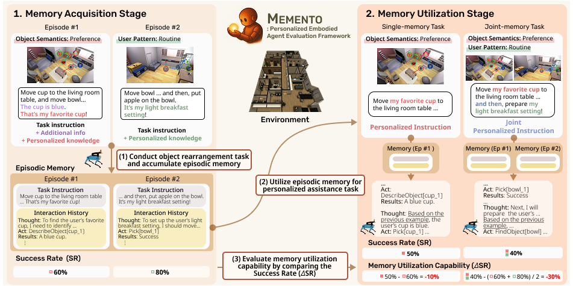

# MEMENTO: Embodied Agents Meet Personalization: Investigating Challenges and Solutions Through the Lens of Memory Utilization



## Abstract

LLM-powered embodied agents have shown success on conventional object-rearrangement tasks, but providing personalized assistance that leverages user-specific knowledge from past interactions presents new challenges. 
We investigate these challenges through the lens of agents' memory utilization along two critical dimensions: object semantics (identifying objects based on personal meaning) and user patterns (recalling sequences from behavioral routines). To assess these capabilities, we construct *MEMENTO*, an end-to-end two-stage evaluation framework comprising single-memory and joint-memory tasks. Our experiments reveal that current agents can recall simple object semantics but struggle to apply sequential user patterns to planning. Through in-depth analysis, we identify two critical bottlenecks: information overload and coordination failures when handling multiple memories. Based on these findings, we explore memory architectural approaches to address these challenges. Given our observation that episodic memory provides both personalized knowledge and in-context learning benefits, we design a hierarchical knowledge graph-based user-profile memory module that separately manages personalized knowledge, achieving substantial improvements on both single and joint-memory tasks.

## Installation
For anonymity reasons, we are unable to share the Docker image directly. Instead, we have uploaded the Dockerfile to the repository.

### Docker File Build
```bash
docker build -t [your_image_name]:[tag] .
```

### Datasets
[Dataset Installation via PARTNR repository](https://github.com/facebookresearch/partnr-planner/blob/main/INSTALLATION.md)

## Setup

### Docker Run Command
```bash
docker run -it \ 
  -v /path/to/local/huggingface_cache/:/data/huggingface_cache/ \ # Path to your local model storage
  -v /path/to/local/habitat_data/:/data/ \ # Path to your local Habitat data
  -v /path/to/local/code/:/HabitatLLM/workspace \ # Path to your local workspace
  -e NVIDIA_DRIVER_CAPABILITIES=all \ 
  -u username \ # Your username
  --gpus all \
  --pid=host \
  --name container_name \ # Container name
  [your_image_name]:[tag] \ # Image name
  /bin/bash
```

### Docker Container Internal Structure
```
/HabitatLLM : repository codes
/HabitatLLM/workspace : share volume with local directory
/third_party: habitat, partnr-planner, ...
```

### Commands to Run Inside Container
```bash
$ source activate
$ conda activate habitat
$ ln -s /data /HabitatLLM/data
$ ln -s /HabitatLLM/workspace/HabitatLLM/src /HabitatLLM/src 
$ ln -s /HabitatLLM/workspace/HabitatLLM/scripts /HabitatLLM/scripts
```

Note: HabitatLLM is separately defined in the workspace to facilitate code management through GitHub by establishing symbolic links between local files and volume mounts inside the container.

## Datasets
Our dataset is categorized into three parts. 
1. Dataset for **memory acquisition** stage
2. Dataset for **memory utilization** stage (**single memory** task)
3. Dataset for **memory utilization** stage (**dual memory** task)

We have uploaded all dataset files to the `./data/datasets/` directory.

## Experiments

### Experiments Settings
MEMENTO includes a structured approach to running experiments, as exemplified by stage1:

1. **Experiment Script**: 
   - Path: `./scripts/acquisition_stage.sh`
   - Used to execute the experiment

2. **Data Definition**:
   - Path: `./src/conf/habitat_conf/dataset/v1/v1_stage1.yaml`
   - Defines the dataset configuration for the experiment

3. **LLM Configuration**:
   - Path: `./llm/[desired_model_API].yaml`
   - Defines the model and API key
   - Current Options: [openai_chat, anthropic, openrouter]
   - Note: Models like Llama and Qwen are accessed via OpenRouter

4. **Experiment Management**:
   - Path: `./src/conf/v1_experiment/v1_stage1.yaml`
   - Controls overall experiment settings

### Configuration Options
- Set the desired model API in `/llm@evaluation.planner.plan_config.llm` option
- Use `build_memory` to generate memory for the experiments
- Use `save_video` to generate simulation video

### Running an Experiment
To run an experiment, simply execute the appropriate script:

```bash
./scripts/acquisition_stage.sh
```

## Citation

```
@article{kwon2025embodied,
  title={Embodied Agents Meet Personalization: Exploring Memory Utilization for Personalized Assistance},
  author={Kwon, Taeyoon and Choi, Dongwook and Kim, Sunghwan and Kim, Hyojun and Moon, Seungjun and Kwak, Beong-woo and Huang, Kuan-Hao and Yeo, Jinyoung},
  journal={arXiv preprint arXiv:2505.16348},
  year={2025}
}
```

Our codebase is based on [PARTNR](https://github.com/facebookresearch/partnr-planner), [Habitat-Lab](https://github.com/facebookresearch/habitat-lab).

If you use our codebase or dataset in your research, please cite the PARTNR and Habitat-Lab.

```
@inproceedings{PARTNR,
  author = {Matthew Chang and Gunjan Chhablani and Alexander Clegg and Mikael Dallaire Cote and Ruta Desai and Michal Hlavac and Vladimir Karashchuk and Jacob Krantz and Roozbeh Mottaghi and Priyam Parashar and Siddharth Patki and Ishita Prasad and Xavier Puig and Akshara Rai and Ram Ramrakhya and Daniel Tran and Joanne Truong and John M. Turner and Eric Undersander and Tsung-Yen Yang},
  title = {PARTNR: A Benchmark for Planning and Reasoning in Embodied Multi-agent Tasks},
  booktitle = {International Conference on Learning Representations (ICLR)},
  note = {alphabetical author order},
  year = {2025}
}
```

```
@misc{puig2023habitat3,
      title  = {Habitat 3.0: A Co-Habitat for Humans, Avatars and Robots},
      author = {Xavi Puig and Eric Undersander and Andrew Szot and Mikael Dallaire Cote and Ruslan Partsey and Jimmy Yang and Ruta Desai and Alexander William Clegg and Michal Hlavac and Tiffany Min and Theo Gervet and Vladimír Vondruš and Vincent-Pierre Berges and John Turner and Oleksandr Maksymets and Zsolt Kira and Mrinal Kalakrishnan and Jitendra Malik and Devendra Singh Chaplot and Unnat Jain and Dhruv Batra and Akshara Rai and Roozbeh Mottaghi},
      year={2023},
      archivePrefix={arXiv},
}

@inproceedings{szot2021habitat,
  title     =     {Habitat 2.0: Training Home Assistants to Rearrange their Habitat},
  author    =     {Andrew Szot and Alex Clegg and Eric Undersander and Erik Wijmans and Yili Zhao and John Turner and Noah Maestre and Mustafa Mukadam and Devendra Chaplot and Oleksandr Maksymets and Aaron Gokaslan and Vladimir Vondrus and Sameer Dharur and Franziska Meier and Wojciech Galuba and Angel Chang and Zsolt Kira and Vladlen Koltun and Jitendra Malik and Manolis Savva and Dhruv Batra},
  booktitle =     {Advances in Neural Information Processing Systems (NeurIPS)},
  year      =     {2021}
}

@inproceedings{habitat19iccv,
  title     =     {Habitat: {A} {P}latform for {E}mbodied {AI} {R}esearch},
  author    =     {Manolis Savva and Abhishek Kadian and Oleksandr Maksymets and Yili Zhao and Erik Wijmans and Bhavana Jain and Julian Straub and Jia Liu and Vladlen Koltun and Jitendra Malik and Devi Parikh and Dhruv Batra},
  booktitle =     {Proceedings of the IEEE/CVF International Conference on Computer Vision (ICCV)},
  year      =     {2019}
}
```

## License
MEMENTO is MIT licensed. See the [LICENSE](LICENSE) for details.
